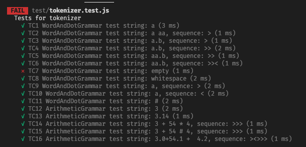

# Mall för inlämning laboration 1, 1dv610

## Checklista
  - [x] I min tokeniserare finns inga tokentyper eller reg-exp. Dessa finns i mitt testprojekt eftersom de skapas utav användaren.
  - [x] Jag har skrivit all kod och reflektioner själv. Jag har inte använt mig av andras kod för att lösa uppgiften.
  - [x] Mina testresultat är skrivna utifrån utförd testning ( och inte teoretiskt, det bör fungera :) )
  - [x] De enda statiska metoder eller funktioner utanför klasser som jag har är för att starta upp min testapplikation ex main(java).
  - [x] De enda bibliotek och färdiga klasser som används är sådana som måste användas (eller som används för att testa modulen).

## Egenskattning och mål
  - [ ] Jag är inte klar eftersom jag vet att jag saknar något. Då skall du inte lämna in!
  - [x] Jag eftersträvar med denna inlämning godkänt betyg (E-D)
    - [x] De flesta testfall fungerar
    - [x] Koden är förberedd på Återanvändning
    - [x] All kod samt historik finns i git 
    - [x] Kodkvaliterskraven är ifyllda
    - [x] Reflektion är skriven
  - [ ] Jag eftersträvar med denna inlämning högre betyg (C-B) och anser mig uppfylla alla extra krav för detta. 
    - [ ] Samtliga testfall är skrivna
    - [ ] Egna testfall för Maximal munch och kantfall
    - [ ] Testfall är automatiserade
    - [ ] Det finns en tydlig beskrivning i hur modulen skall användas (i git)
    - [ ] Kodkvalitetskraven är varierade 
  - [ ] Jag eftersträvar med denna inlämning högsta betyg (A) 

Förtydligande: Examinator kommer sätta betyg oberoende på vad ni anser. 

## Återanvändning
Beskriv hur du anpassat din kod och instruktioner för att någon annan programmerare skall kunna använda din tokenizer. Om du skrivit instruktioner för din användare länka till dessa. Om inte beskriv här hur någon skall göra för att använda din kod med sin egen grammatik. 

## Beskrivning av min kod
Genom klassen grammar kan man skapa ett object som då blir i det formatet som tokenizer är tänkt att använda. Genom grammar kan man alltså skicka in sina egna typer och vilka regex man vill använda tillsammamns med tokenizer. Något jag reflekterat över är att jag kunde brutit ut vissa methoder och kanske skapat flera mindre klasser för såsom jag gjort nu så vart själva tokenizern ganska stor och kanske lite matig att sätta sig in i. Kanske en klass för att hantera error och en för att hantera möjligheten att kunna navigera i sin tokensträng möjligtvis.

## Hur jag testat
Under tiden jag har utvecklat min tokenizer har jag testat mycket genom att skriva ut olika information i terminalen för att kolla att rätt saker skrivs ut och returneras. När jag började känns mig ganska klar började jag testa med jest. Hittade direkt några fel så fortsättningsvis så vill jag nog implementera jest tidigare just för att börja testa ordentligt tidigare.

### Testfall
Jag har valt att köra automatiska tester med Jest då jag har kommit i kontakt med jest tidigare i mitt projektarbete i våras. I testerna kunde jag snabbt snappa upp fel som man lätt annars hade missat och kunde rätta till en del av koden som inte fungerade till belåtenhet. Jag har ett test som ej går igenom och tänker att jag får stå för det felet och visa upp det. Jag har inte hanterat vad som ska hända om användaren skickar in en tom sträng vilket då gör att jag får undefined när man ska hämta aktivt token. Detta behöver lösas genon att alltid kolla om strängen är tom eller inte och sedan hantera detta vid tillfällen då strängen som skickas in faktiskt är tom.

Du kan tillföra kommentarer om din tokeniserare skiljer sig något från standard. 

## Kodkvalitetskrav

### Namngivning

| Namn&förklaring  | Reflektion                                   |
| -------------------- | ---------------------------------------------|
|       Tokenizer-klassnamn på själva tokenizern  | Jag tycker att min namngivning av klassen Tokenizer följer de exempel som boken ger där det framgår att **klasser bör ha namn som säger vad den är för något** snarare än att använda sig av ett verb som skulle beskriva vad den gör. Det är även ett namn som är **lätt att uttala** vilket även detta beskrivs i boken Clean Code.                                             |
|   Grammar - namn på klassen som skapar nya grammatikobject|                 Här skulle jag nu i efterhand på något vis förtydliga vad denna klassen egentligen är för något utan att ta till ett verb som man ska undvika att ha klassnamnen. I mina ögon är denna klassen en grammatikskapare och det hade man velat skulle framgå i namnet så att användaren lätt skulle kunna förstå vad denna gör. Själva klassen är väldigt simpel i sig så koden är lätt att förstå när man väl är inne i filen men vid ett första ögonkast på just enbart namnet så säger den inte tillräckligt.                              |
|   Tokenizer.getActiveToken()|   Metodennamnet beskriver det den faktiskt gör, dvs hämtar det token som är aktivt så på den här functionen anser jag att namngivningen ändå har lyckats väl. Tror inte att den behöver någon kommentar eller dylikt för att användaren ska första vad som händer sålänge de är införstådda med vad en tokenizer gör vilket framgår i readme filen.                                            |
|   Tokenizer.tokenizeTheString()                    |                 Namnet på tokenizeTheString kör på **verbnamgivningen** som rekommenderas i boken och beskriver ganska väl vad den gör. Dock tar den för givet att användaren har lite kännedom om vad en tokenizer är för något, vilket jag själv till exempel inte visste någonting alls om innan den här uppgiften.                              |
|   Tokenizer.findBestMatchOfTokenValue()                    |                 Funktionsnamnet är enkelt att uttala, något för lång men beskriver ändå tydligt vad det är funktionen faktiskt gör. Jag kan ändå tycka att det inte på ett enkelt sätt går att genom namngivningen berätta vad det är som egentligen matchas. kanske att man skulle ha kunnat byta namnet mot något där det framgår att det är tokens från strängen som matchas mot våra regex regler. Även denna funktionen följer det som boken beskriver såsom att man ska använda sig av **verb** som beskriver vad funktionen gör samt **enkla namn** att uttala. Namnen är dessutom såpass unika så de blir **enkla att söka** på i koden.                             |

### Funktioner

| Metodnamn och förklaring  | Reflektion                                   |
| -------------------  | ---------------------------------------------|
|  returnErrorObject()   |    Denna metoden returnerar ett object med information om att tokenmatchningen inte lyckades med dee angiva regex-reglerna. Här hade man kan ske vilja ha ettv tydligare namn till exempel. ReturnErrorObject säger inget om när detta inträffar, vid vilket fel anropas just denna funktionen?                                          |
TheTokenizer.getPreviousToken() | Denna metoden sätter aktivt token till föregående token. Det gör att namngivningen här är förvirrande och något jag kommer att ändra. Den heter just getPreviousToken och den hämtar ingen token utan den sätter enbart om det aktiva tokenet till föregående. Vill man hämta det token som är aktivt så är det isåfall metoden getActiveToken man använder sig utav. |
Grammar.createNewGrammar() | Denna methoden skapar ett object med hjälp av parametrarna som skickas in i klassen Grammar.Objectet består av typen och regex som behövs för att skapa ett nyttset av regler till sin tokenizer. I denna skickar man alltså in vilken typ av regex mamn vill skapa. Här kommer jag vilja skapa någon form av loopning så man ska kunna skicka in flera regex för att skapa sitt nya set av regler men på grund av tidsbrist har inte detta blivit implementerat än. |
Tokenizer.checkIfTokenIsValid() | Här vill jag belysa en funktion som inte är helt färdigställd då jag inte fick den att fungera som tänkt i tid. Jag vill med denna funktionen  validera varje token när man ska hämta sitt aktiva token för att se om tokentypen är 'invalid' och att man då kastar ett fel som användaren kan ta hand om. |
Tokenizer.sendEndMessage() | Denna funktionen skickar in ett object med typen och value END samt ett meddelande att man har nått änden av sin token-sträng. Tanken är att man ska få detta när man navigerar "över kanten" på sin sträng, i detta fallet änden av strängen. Jag har även gjort en likadan fast till start-änden som heter sendStartMessage. Ska man se över namngivningen så är den inte helt tydlig. Jga hade velat att det var mer beskrivet vad den gör och den skickar egentligen ingenting utan den lägger till ett object med information om att strängen har nått sin ändstation. |
